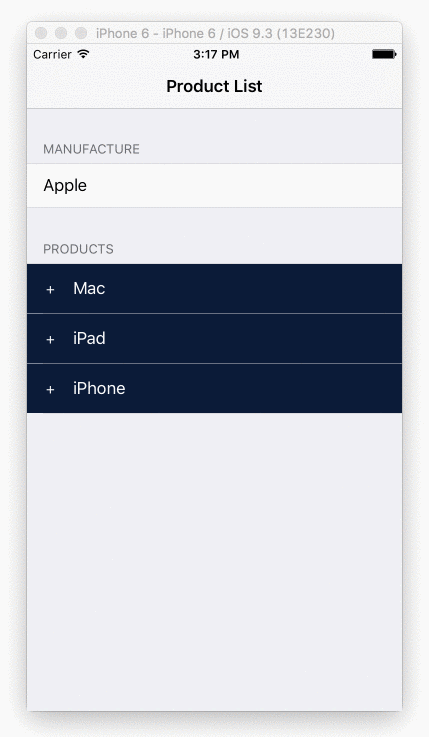
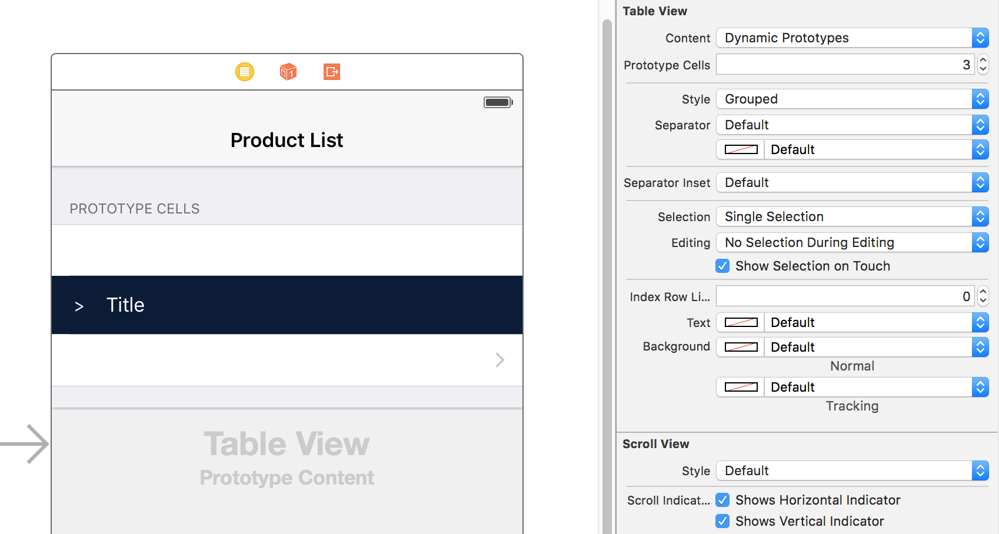

# Collapsible Table Section in Grouped Table
A simple iOS swift project demonstrates how to implement collapsible table section.

### Demo ###
<br />

### How to implement collapsible table sections? ###

#### Step 1. Prepare the Data ####

Let's say we have the following data that is grouped to different sections, each section is a `Section` object:

```swift
struct Section {
  var name: String!
  var items: [String]!
  var collapsed: Bool!
    
  init(name: String, items: [String]) {
    self.name = name
    self.items = items
    self.collapsed = false
  }
}
    
var sections = [Section]()

sections = [
  Section(name: "Mac", items: ["MacBook", "MacBook Air", "MacBook Pro", "iMac", "Mac Pro", "Mac mini", "Accessories", "OS X El Capitan"]),
  Section(name: "iPad", items: ["iPad Pro", "iPad Air 2", "iPad mini 4", "Accessories"]),
  Section(name: "iPhone", items: ["iPhone 6s", "iPhone 6", "iPhone SE", "Accessories"])
]
```
`collapsed` indicates whether the current section is collapsed or not, by default is `false`.

#### Step 2. Design the Header and the Cell ####

Select the `Table View` in the story board, choose `Grouped` style, choose `Dynamic Prototypes` and set `Prototype Cells` to `3`, one for the title cell, one for the custom header and one for the row cells, and assign the `Identifier` to `title`, `header` and `cell` respectively.

<br />

Add a UIButton (the toggler) and a Label to the header prototype cell, create a swift file which extends `UITableViewCell` and name it `HeaderCell.swift`. The file is super simple, it defines two IBOutlets for the toggle button and label. Finally set the header cell class to our custom header `HeaderCell` and link the IBOutlets.

Now the file should look like this:

```swift
import UIKit

class HeaderCell: UITableViewCell {
    
  @IBOutlet var titleLabel: UILabel!
  @IBOutlet var toggleButton: UIButton!
    
}
```

By creating a prototype cell and subclassing UITableViewCell, we have the following benefits:
* We can visually design the custom header
* We shouldn't need to create a nib and register it to the the tableView like so:

```swift
let nib = UINib(nibName: "TableSectionHeader", bundle: nil)
tableView.registerNib(nib, forHeaderFooterViewReuseIdentifier: "TableSectionHeader")
```

personally I don't like having nibs in my project and if we use `dequeueReusableHeaderFooterViewWithIdentifier`, seems like we must have at least 1 row in that section, but we need to have 0 row!

#### Step 3. The UITableViewDelegate  ####

First the number of sections is `2`:

```swift
override func numberOfSectionsInTableView(tableView: UITableView) -> Int {
  return 2
}
```

Let's setup the titles for each section:

```swift
override func tableView(tableView: UITableView, titleForHeaderInSection section: Int) -> String? {
  switch section {
    case 0:  return "Manufacture"
    case 1:  return "Products"
    default: return ""
  }
}
```

For the number of rows in each section, obviously there's only one row in section `0`, and the total count for section `1` is items count plus the headers count:

```swift
override func tableView(tableView: UITableView, numberOfRowsInSection section: Int) -> Int {
  if section == 0 {
    return 1
  }
  
  // For section 1, the total count is items count plus the number of headers
  var count = sections.count
  
  for section in sections {
    count += section.items.count
  }
  
  return count
}
```

Here is the magic of how we manage the show/hide of the cells, basically, if the data section is collapsed, the height of the row should be 0!

```swift
override func tableView(tableView: UITableView, heightForRowAtIndexPath indexPath: NSIndexPath) -> CGFloat {
  if indexPath.section == 0 {
    return tableView.rowHeight
  }
  
  // Calculate the real section index and row index
  let section = getSectionIndex(indexPath.row)
  let row = getRowIndex(indexPath.row)
  
  // Header has fixed height
  if row == 0 {
    return 50.0
  }
  
  return sections[section].collapsed! ? 0 : 44.0
}
```

We have to deal with the cells for each group, the title group is pretty simple, it's just a normal UITableViewCell, for the second group, this is how we re-organize the data: each section contains a header cell plus all the items cell, so if section one has 10 items, then row `0` to `10` belong to section `0`, if section two has 5 items, then row `11` to `16` belong to section `1`.

The `getSectionIndex` and `getRowIndex` helpers calculate the section index and row index based on the `indexPath.row`, remembe we need to take the header into account.

```swift
override func tableView(tableView: UITableView, cellForRowAtIndexPath indexPath: NSIndexPath) -> UITableViewCell {
  if indexPath.section == 0 {
    let cell = tableView.dequeueReusableCellWithIdentifier("title") as UITableViewCell!
    cell.textLabel?.text = "Apple"
    return cell
  }
  
  // Calculate the real section index and row index
  let section = getSectionIndex(indexPath.row)
  let row = getRowIndex(indexPath.row)
  
  if row == 0 {
    let cell = tableView.dequeueReusableCellWithIdentifier("header") as! HeaderCell
    cell.titleLabel.text = sections[section].name
    cell.toggleButton.tag = section
    cell.toggleButton.setTitle(sections[section].collapsed! ? "+" : "-", forState: .Normal)
    cell.toggleButton.addTarget(self, action: #selector(ViewController.toggleCollapse), forControlEvents: .TouchUpInside)
    return cell
  } else {
    let cell = tableView.dequeueReusableCellWithIdentifier("cell") as UITableViewCell!
    cell.textLabel?.text = sections[section].items[row - 1]
    return cell
  }
}
```

noticed that we register the touch up inside event for the toggler, once it's tapped, it will trigger the `toggleCollapse` function.

And here is the toggle function:

```swift
func toggleCollapse(sender: UIButton) {
  let section = sender.tag
  let collapsed = sections[section].collapsed
  
  // Toggle collapse
  sections[section].collapsed = !collapsed
  
  let indices = getHeaderIndices()
  
  let start = indices[section]
  let end = start + sections[section].items.count
  
  tableView.beginUpdates()
  for i in start ..< end + 1 {
    tableView.reloadRowsAtIndexPaths([NSIndexPath(forRow: i, inSection: 1)], withRowAnimation: .Automatic)
  }
  tableView.endUpdates()
}
```

We only want to refresh related cells of certain section, so we choose `reloadRowsAtIndexPaths` function, if we use `reloadSections`, the animation looks odd. Also we don't modify the number of rows in `numberOfRowsInSection` delegate, because `reloadRowsAtIndexPaths` requires that the number of rows should match before and after updates, otherwise an error will prompt:

Invalid update: invalid number of rows in section 1.  The number of rows contained in an existing section after the update (11) must be equal to the number of rows contained in that section before the update (3), plus or minus the number of rows inserted or deleted from that section (0 inserted, 0 deleted) and plus or minus the number of rows moved into or out of that section (0 moved in, 0 moved out).

That's it, please refer to the source code and see the detailed implementation.
